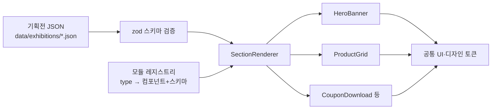

# LG 기획전·이벤트 통합 모듈 사전 제작 기획안

> 원본: claude.ai 아티팩트 문서의 로컬 사본 (2026-09-23 기준). 이후 원본이 갱신되면 이 파일도
> 함께 갱신한다.

10월 초 투입 전에, 설정(JSON)만 바꾸면 여러 기획전 페이지가 조립되는 Next.js 모듈 테스트앱을
Claude로 직접 만들어본다.

## 목표와 범위

테스트앱의 목표는 하나다. **"기획전 페이지를 새로 개발하지 않고, 공통 모듈을 설정값으로
조립해서 만든다"**를 실제로 동작하는 코드로 보여주는 것.

**만드는 것**

- 공통 UI 기초: 디자인 토큰(색·여백·타이포), Button, Badge, Price, Image, Section 래퍼
- 기획전 모듈 8~10개 (아래 모듈 카탈로그의 P0·P1)
- JSON 한 파일로 기획전 1개를 정의하고 `/exhibitions/[id]`에서 렌더링하는 구조
- 서로 다른 샘플 기획전 2~3개 (같은 모듈, 다른 설정 → 다른 페이지)
- Storybook 카탈로그, 반응형(PC/모바일), 기본 웹 접근성

**안 만드는 것 (테스트앱 범위 밖)**

- 실제 로그인·결제·장바구니 연동 → 버튼 동작은 mock으로 처리
- 관리자(CMS) 화면 → JSON 파일 편집으로 대신하고, 여유 있으면 간단한 미리보기만
- LG 실제 이미지·로고·상표 → 샘플 브랜드와 placeholder 이미지 사용 (포트폴리오로 공개할 수 있게)

## 벤치마킹

LG닷컴 기획전은 같은 형태의 섹션(배너 슬라이드, 카테고리 탭, 상품 슬라이더, 혜택 문구)이
기획전마다 내용만 바뀌어 반복된다. 그래서 "모듈 + 설정값" 구조가 딱 맞는다.

**LG닷컴 기획전에서 보이는 요소** ([모니터 통합 기획전](https://www.lge.co.kr/benefits/exhibitions/detail-PE00923012), [LG DAY](https://www.lge.co.kr/benefits/exhibitions/detail-PE00455001), [혜택/이벤트 목록](https://www.lge.co.kr/benefits) 기준)

| 영역          | 구성                                                                    | 인터랙션                           |
| ------------- | ----------------------------------------------------------------------- | ---------------------------------- |
| 상단          | 기획전 제목, 뒤로가기, "마감임박" 등 다른 이벤트 연결 배너              | 공유(카카오톡·페이스북·URL 복사)   |
| 배너 슬라이드 | 프로모션 카드: 제목, 기간(예: 9.1~9.30), 할인 문구(최대 30%), 한정 수량 | 자동 로테이션, 이전/다음, 일시정지 |
| 카테고리 탭   | LG SIGNATURE, 오브제컬렉션, 소모품 등 라인별 묶음                       | 탭 전환, 섹션별 슬라이더           |
| 상품 슬라이더 | 상품 썸네일 카드 반복                                                   | 이전/다음, 일시정지                |
| 목록 페이지   | 이벤트 카드(제목·기간·배지·설명), 카테고리 필터                         | 필터, 캐러셀                       |

기획전 종류는 시즌 세일(추석맞이), 닷컴 전용 할인, 반납·보상, 한정 수량 특가처럼 다양하지만
사용하는 부품은 거의 같다. 페이지가 JS로 렌더링돼서 자동 수집에 한계가 있었으니, 브라우저로
기획전 3~4개를 직접 열어 섹션 스크린샷을 모아두면 좋다.

**"모듈 조립형 페이지" 구조 벤치마킹**

| 사례                                                                | 핵심 아이디어                                                                                                                                                                   | 테스트앱에 가져올 것                                                        |
| ------------------------------------------------------------------- | ------------------------------------------------------------------------------------------------------------------------------------------------------------------------------- | --------------------------------------------------------------------------- |
| [Builder.io](https://www.builder.io/c/docs/custom-components-setup) | 개발자가 React 컴포넌트를 등록(register)하고 inputs(props 스키마)를 선언하면, 비개발자가 드래그앤드롭으로 페이지를 조립한다                                                     | 모듈마다 "컴포넌트 + 편집 가능한 props 스키마"를 쌍으로 등록하는 레지스트리 |
| [Storyblok](https://www.storyblok.com/docs/guides/nextjs)           | 콘텐츠는 "블록(blok)" 트리, 프론트는 블록 타입 → 컴포넌트 매핑으로 그린다                                                                                                       | `type` 필드로 컴포넌트를 찾는 동적 렌더러                                   |
| [Payload CMS Blocks](https://payloadcms.com/docs/fields/blocks)     | 페이지의 layout 필드가 여러 블록 타입의 배열이고, 블록마다 필드 스키마가 있다 ([가이드](https://payloadcms.com/posts/guides/how-to-build-flexible-layouts-with-payload-blocks)) | 페이지 JSON = `sections: Block[]` 배열, 블록별 타입 정의                    |

세 곳 모두 같은 패턴이다: **블록 타입 목록 + 블록별 스키마 + 타입→컴포넌트 매핑**. 테스트앱은
CMS 없이 이 패턴을 JSON 파일로 구현하고, 나중에 어떤 CMS를 붙여도 그대로 쓸 수 있게 만든다.

## 모듈 카탈로그

P0 6개만 있어도 기획전 한 페이지가 완성된다. P1은 쿠폰·응모 같은 이벤트 상호작용을, P2는 여유가
있을 때 만든다.

| 우선 | 모듈                           | 주요 props (설정값)                                     | 체크 포인트                                    |
| ---- | ------------------------------ | ------------------------------------------------------- | ---------------------------------------------- |
| P0   | HeroBanner                     | 제목, 부제, 기간, 배경 이미지(PC/MO 별도), CTA          | 이미지 반응형, 텍스트 대체텍스트               |
| P0   | BannerCarousel                 | 슬라이드[] (제목·기간·배지·링크), 자동재생 간격         | 일시정지 버튼(접근성 필수), 키보드 조작        |
| P0   | AnchorTabs                     | 탭[] (라벨 → 섹션 id), sticky 여부                      | 스크롤 시 현재 탭 하이라이트                   |
| P0   | ProductGrid / ProductSlider    | 상품[] 또는 카테고리 코드, 열 수, 가격·할인율 표시 여부 | 하나의 ProductCard를 그리드와 슬라이더가 공유  |
| P0   | BenefitCards                   | 혜택[] (아이콘, 타이틀, 설명: 카드할인·사은품·멤버십)   | 2~4열 자동 배치                                |
| P0   | NoticeAccordion                | 유의사항 항목[], 기본 펼침 여부                         | aria-expanded, 긴 문서 대응                    |
| P1   | CouponDownload                 | 쿠폰[] (할인액·조건·기간), 로그인 필요 여부             | 다운로드 완료/소진 상태 (mock API)             |
| P1   | CountdownTimer                 | 종료 시각, 종료 후 문구                                 | 서버/클라이언트 시간 차이, hydration 오류 방지 |
| P1   | EventEntryForm                 | 응모 항목, 개인정보 동의 문구                           | 검증, 중복 응모 처리 (mock)                    |
| P1   | ShareBar                       | 공유 채널 목록                                          | URL 복사 토스트                                |
| P2   | VideoBlock, RichText, ImageMap | 영상 URL, HTML 문구, 클릭 영역                          | 자유 콘텐츠 영역                               |

모든 모듈은 공통으로 `id`(앵커용), `visible`(노출 여부), `period`(노출 기간), `tracking`(로그
키)를 갖게 한다. 이 공통 필드가 "통합 모듈"의 핵심이다.

## 아키텍처

페이지 JSON → 스키마 검증 → 레지스트리에서 컴포넌트 찾기 → 순서대로 렌더링. 새 기획전은
JSON만 추가하고, 새 모듈은 컴포넌트 + 스키마를 레지스트리에 등록만 하면 된다.



맨 아래 공통 UI는 모든 모듈이 같이 쓰므로, 여기를 먼저 확정해야 AI가 버튼·카드를 중복으로
만들지 않는다.

**기획전 JSON 예시**

```json
{
  "id": "autumn-sale-2026",
  "title": "가을맞이 소모품 특가전",
  "period": { "start": "2026-10-01", "end": "2026-10-31" },
  "theme": { "accent": "#E4002B" },
  "sections": [
    {
      "type": "heroBanner",
      "id": "hero",
      "props": {
        "title": "최대 30% 할인",
        "image": { "pc": "/img/hero-pc.jpg", "mo": "/img/hero-mo.jpg", "alt": "가을 특가" }
      }
    },
    {
      "type": "anchorTabs",
      "id": "tabs",
      "props": {
        "sticky": true,
        "items": [
          { "label": "쿠폰", "target": "coupon" },
          { "label": "상품", "target": "products" }
        ]
      }
    },
    {
      "type": "couponDownload",
      "id": "coupon",
      "props": { "coupons": [{ "amount": 10000, "minPrice": 100000 }] }
    },
    {
      "type": "productGrid",
      "id": "products",
      "props": { "columns": 4, "productIds": ["P001", "P002"] }
    },
    {
      "type": "noticeAccordion",
      "id": "notice",
      "props": { "items": ["쿠폰은 1인 1회 사용 가능합니다."] }
    }
  ]
}
```

**설계 원칙**

- 모듈은 데이터를 직접 불러오지 않고 props만 받는다 (상품 조회는 서버 컴포넌트에서 처리 후 전달)
- 서버 컴포넌트가 기본, 상호작용이 있는 부분(캐러셀·타이머·쿠폰)만 `"use client"`
- 알 수 없는 `type`이나 스키마 오류는 페이지 전체를 깨지 않고 해당 섹션만 숨기며 개발 모드에서 경고
- 모듈 간 간격·배경은 Section 래퍼가 담당 (모듈 내부에 바깥 여백 금지)

## 기술 스택과 폴더 구조

공고에 명시된 Next.js·React·Claude를 고정하고, 나머지는 현업에서 흔한 선택지로 고른다. 실제
팀 스택은 입사 후 확인해야 하므로 스타일링은 바꾸기 쉽게 둔다.

| 영역        | 선택                                                         | 이유                                                                     |
| ----------- | ------------------------------------------------------------ | ------------------------------------------------------------------------ |
| 프레임워크  | Next.js (App Router) + TypeScript                            | 공고 환경, 서버/클라이언트 컴포넌트 구분 연습                            |
| 스타일      | CSS Modules + CSS 변수(디자인 토큰)                          | 대기업 사이트는 기존 CSS 체계가 있는 경우가 많아 토큰 방식이 이식에 유리 |
| 스키마 검증 | zod                                                          | JSON 설정 검증 + TypeScript 타입 자동 생성                               |
| 카탈로그    | Storybook                                                    | 모듈별 상태(기본·빈 데이터·모바일) 확인, 중복 컴포넌트 방지              |
| 테스트      | Vitest + Testing Library, Playwright(스모크 1~2개)           | "컴파일됨"과 "화면에서 됨" 구분                                          |
| 품질        | ESLint, Prettier, eslint-plugin-jsx-a11y                     | 팀 규칙을 도구로 강제                                                    |
| CI/CD       | GitHub Actions(린트·타입·테스트·빌드) + Vercel 미리보기 배포 | PR마다 화면 확인 링크 생성                                               |
| mock API    | Next.js Route Handler (`app/api/...`)                        | 쿠폰·응모 동작 흉내                                                      |

```
exhibition-modules/
├─ CLAUDE.md                  # AI용 팀 규칙
├─ docs/specs/                # 모듈별 스펙 (props·상태·예외)
├─ data/exhibitions/*.json    # 기획전 설정
├─ src/
│  ├─ app/exhibitions/[id]/page.tsx
│  ├─ app/api/coupons/route.ts   # mock
│  ├─ styles/tokens.css
│  ├─ components/ui/         # Button, Badge, Price, Section ...
│  ├─ modules/
│  │  ├─ hero-banner/
│  │  │  ├─ HeroBanner.tsx
│  │  │  ├─ schema.ts
│  │  │  ├─ HeroBanner.stories.tsx
│  │  │  └─ HeroBanner.test.tsx
│  │  └─ ...
│  ├─ registry.ts            # type → { component, schema }
│  └─ SectionRenderer.tsx
└─ .github/workflows/ci.yml
```

모듈 하나 = 폴더 하나(컴포넌트·스키마·스토리·테스트)라서, 팀원끼리 폴더 단위로 나눠 맡으면
충돌이 거의 없다.

## 팀 바이브코딩 방식으로 진행하기

혼자 만들더라도 3~4명 팀이 쓰는 방식 그대로 진행한다. 그래야 팀 바이브코딩 경험이 되고,
면접에서 보여줄 수 있다.

**1. 레포 전용 CLAUDE.md를 먼저 쓴다** (개인 전역 설정과 분리)

- 폴더 구조, 모듈 추가 절차(폴더 생성 → schema → 컴포넌트 → story → test → registry 등록)
- "새 UI를 만들기 전에 `components/ui`를 먼저 찾아 재사용한다", "색·여백은 토큰만 쓴다"
- 금지: 하드코딩 색상, 모듈 안에서 fetch, 새 라이브러리 임의 추가
- 완료 기준: lint·타입·테스트 통과 + Storybook에서 모바일/PC 확인

**2. 스펙 먼저, 구현은 나중**

모듈마다 `docs/specs/<모듈>.md`에 props, 상태, 반응형, 예외 케이스를 적는다. 초안은 Claude가
쓰고 사람이 확정한다. 구현 프롬프트는 "이 스펙대로 만들어"로 짧아진다.

**3. 가상 팀 분담으로 브랜치를 나눈다**

| 가상 담당  | 범위                                               | 브랜치 예시            |
| ---------- | -------------------------------------------------- | ---------------------- |
| A (기반)   | 토큰, 공통 UI, registry, SectionRenderer           | `feat/foundation`      |
| B (전시)   | HeroBanner, BannerCarousel, BenefitCards           | `feat/display-modules` |
| C (상품)   | ProductCard, ProductGrid/Slider, AnchorTabs        | `feat/product-modules` |
| D (이벤트) | Coupon, Countdown, EventEntryForm, NoticeAccordion | `feat/event-modules`   |

A를 먼저 main에 병합한 뒤 B·C·D를 병렬로 진행한다. Claude Code 세션을 브랜치(또는 git
worktree)마다 따로 띄우면 실제 팀처럼 여러 사람의 작업이 합쳐지는 경험을 할 수 있다.

**4. PR 리뷰는 사람 + AI**

PR 템플릿에 체크리스트를 둔다: 공통 UI를 재사용했는가, 토큰만 썼는가, 스토리와 테스트가
있는가, 접근성 경고가 없는가. 다른 Claude 세션에게 리뷰를 시켜 사람의 판단과 비교한다.

**5. 잘 통한 프롬프트를 자산으로 만든다**

"새 모듈 추가" 과정을 Claude Code 커스텀 명령(예: `/new-module coupon-download`)이나 스킬로
만들어 둔다. 이게 팀 생산성을 가장 크게 올리는 부분이고, 포트폴리오에서도 가장 좋은 어필
포인트다.

## 일정

투입(10월 초)까지 추석 연휴를 끼고 약 10일이 남아 있어, 하루 2~4시간 기준으로 잡았다. Day 6까지
P0가 돌아가면 그 뒤는 여유만큼 더하면 된다.

| 날      | 할 일                                                                   | 끝났을 때 결과물               |
| ------- | ----------------------------------------------------------------------- | ------------------------------ |
| Day 1   | LG닷컴 기획전 3~4개 스크린샷 수집, 모듈 목록 확정, 레포 생성            | GitHub 레포, Next.js 초기 세팅 |
| Day 2   | CLAUDE.md, 디자인 토큰, 공통 UI 5개, ESLint/Prettier, CI                | `feat/foundation` 병합         |
| Day 3   | registry + SectionRenderer + zod 스키마 구조, 빈 기획전 JSON 1개 렌더링 | JSON → 화면 흐름 동작          |
| Day 4   | 모듈 스펙 문서(P0), Storybook 세팅                                      | `docs/specs/` 6개              |
| Day 5~6 | P0 모듈 6개 구현 (B·C 브랜치 병렬)                                      | 샘플 기획전 1개 완성           |
| Day 7~8 | P1 모듈(쿠폰·타이머·응모·공유) + mock API                               | "이벤트" 동작                  |
| Day 9   | 샘플 기획전 2~3개 추가, 반응형·접근성 점검, Playwright 스모크           | Vercel 배포 링크               |
| Day 10  | README(구조·AI 활용 방식·회고), `/new-module` 명령 정리                 | 포트폴리오 완성                |

## 완료 기준과 면접 어필 포인트

**완료 기준**

- [ ] JSON 파일만 추가해서 새 기획전 페이지가 뜬다 (코드 수정 0줄)
- [ ] 같은 모듈로 모양이 다른 샘플 기획전이 2개 이상 있다
- [ ] 잘못된 JSON을 넣어도 페이지가 깨지지 않고 해당 섹션만 빠진다
- [ ] 모든 모듈이 Storybook에 있고, PC/모바일 스토리가 있다
- [ ] CI(린트·타입·테스트·빌드) 통과, Vercel 배포 링크 있음
- [ ] 키보드만으로 탭·캐러셀·아코디언을 조작할 수 있다

**면접·투입 초기에 보여줄 것**

- "모듈 하나 추가하는 데 몇 분 걸리나요?" → `/new-module` 명령으로 시연
- CLAUDE.md와 PR 체크리스트: AI 코드 품질을 어떻게 관리했는지의 근거
- README의 회고: Claude가 자주 틀린 것과 그걸 막은 규칙 (예: 버튼 중복 생성 → "ui 먼저 찾기" 규칙 추가)
- 설계 선택의 이유: 서버/클라이언트 컴포넌트 분리, 스키마 검증, CMS에 붙이기 쉬운 구조

**입사 후 확인할 것**: 기존 디자인 시스템 유무, CMS/관리자 연동 방식, 스타일링 방식, 사용하는
Claude 도구(Claude Code인지), 브랜치·리뷰 규칙, 트래킹(로그) 규격.

## 출처

- [LG 모니터 통합 기획전 | LG전자](https://www.lge.co.kr/benefits/exhibitions/detail-PE00923012)
- [LG DAY 기획전 | LG전자](https://www.lge.co.kr/benefits/exhibitions/detail-PE00455001)
- [혜택/이벤트 | LG전자](https://www.lge.co.kr/benefits)
- [Builder.io — Register Custom Components](https://www.builder.io/c/docs/custom-components-setup)
- [Storyblok — Integrate Next.js](https://www.storyblok.com/docs/guides/nextjs)
- [Payload — Blocks Field](https://payloadcms.com/docs/fields/blocks)
- [Payload — How to build flexible layouts with blocks](https://payloadcms.com/posts/guides/how-to-build-flexible-layouts-with-payload-blocks)
